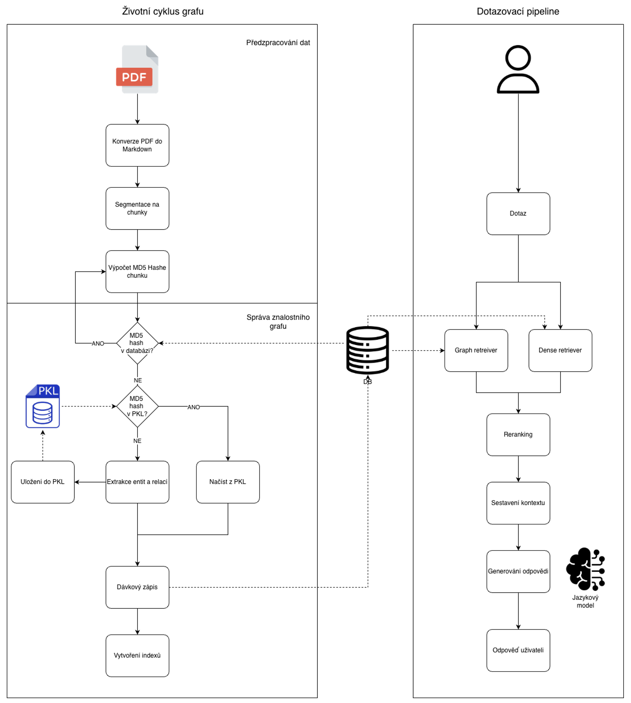

# GraphRAG Lifecycle — Znalostní graf nad technickou dokumentací

Implementace životního cyklu znalostního grafu nad technickou dokumentací s využitím malých lokálních jazykových modelů. Systém kombinuje grafové a vektorové vyhledávání (GraphRAG) a je provozovatelný zcela lokálně bez závislosti na komerčních cloudových API.

---

## Architektura



**Integrační vrstva:** LangChain (`LLMGraphTransformer`, `Neo4jVector`, `ChatPromptTemplate`)  
**Lokální LLM:** Llama 3.1 8B přes Ollama  
**Inkrementální správa:** MD5 hashování chunků + PKL cache

---

## Požadavky

- Python 3.11
- [Ollama](https://ollama.com) — pro lokální běh jazykových modelů
- [Docker Desktop](https://www.docker.com/products/docker-desktop/) 

---

## Instalace

### 1. Klonování repozitáře

```bash
git clone https://github.com/ngum17/graphrag-lifecycle-local.git
cd graphrag-lifecycle-local
```

### 2. Instalace Python závislostí

```bash
pip install -r requirements.txt
```

### 3. Konfigurace prostředí

Zkopírovat šablonu a vyplnit přihlašovací údaje k Neo4j:

```bash
cp .env.example .env
```

Obsah `.env`:

```
NEO4J_URI=bolt://localhost:7687
NEO4J_USERNAME=neo4j
NEO4J_PASSWORD=your_password
```

### 4. Spuštění Neo4j

```bash
docker-compose up -d
```

### 5. Stažení a spuštění jazykových modelů

Před prvním spuštěním je nutné stáhnout modely přes Ollama:

```bash
ollama pull llama3.1:8b

ollama pull qwen2.5:7b
```

Spuštění Ollama serveru:

```bash
ollama serve
```

---

## Použití

### Konverze PDF na Markdown

Pro konverzi PDF dokumentů spustit `notebooks/md_converter.ipynb`.  
Výstupní `.md` soubory jsou uloženy ve složce `documents/md/`.

### Sestavení znalostního grafu a evaluace

Pro sestavení grafu a evaluaci spustit `notebooks/graphrag_pipeline_eval_*.ipynb`.

Notebook obsahuje dvě části:

1. **Pipeline** — načtení dokumentu, build grafu, indexy, retrievery, RAG chain
2. **Evaluace** — testovací sady, metriky (BERTScore, ROUGE-L, RAGAS)

### Streamlit aplikace

Spuštění aplikace:

```bash
streamlit run app/app.py
```

Aplikace zpřístupňuje záložky:

- **PDF na Markdown** — konverze zdrojových dokumentů
- **Sestavení grafu** — inkrementální extrakce entit a vztahů
- **Dotazování** — hybridní GraphRAG pipeline s logem retrievalu

---

## Struktura projektu

```
graphrag-lifecycle-local/
├── app/
│   └── app.py                            # Streamlit aplikace
├── cache/                                # PKL cache (extrakce entit)
│   ├── AF_II_05_05_Prediktivni_Analytika-2.pkl
│   ├── AF_III_02_01__Strojirenska_Firma.pkl
│   └── AF_III_02_01_06_Stroj_Planovani_PA.pkl
├── docs/
│   └── architecture.png                  # Diagram architektury
├── documents/
│   ├── md/                               # Zdrojové dokumenty (Markdown)
│   └── pdf/                              # Zdrojové dokumenty (PDF)
├── evaluation/
│   ├── evaluation_strojirenska_firma.csv
│   └── evaluation_planovani_pa.csv
├── graphs/                               # Exporty znalostních grafů
│   ├── AF_III_02_01__Strojirenska_Firma.graphml   
│   └── AF_III_02_01_06_Stroj_Planovani_PA.graphml 
├── neo4j/                                # Docker konfigurace Neo4j
├── notebooks/
│   ├── md_converter.ipynb                # PDF -> Markdown konverze
│   ├── graphrag_pipeline_eval_SF.ipynb   # Pipeline + evaluace (Strojirenska firma)
│   └── graphrag_pipeline_eval_PA.ipynb   # Pipeline + evaluace (Planovani a analytika)
├── docker-compose.yaml
├── requirements.txt
├── .env.example                          # Šablona konfigurace (bez hesel)
└── .gitignore
```

---

## Evaluace

Systém byl evaluován na dvou dokumentech z oblasti řízení výrobních podniků pomocí metrik:

| Metrika                | Popis                                      |
| ---------------------- | ------------------------------------------ |
| ROUGE-L                | Lexikální překryv s referenční odpovědí    |
| BERTScore              | Sémantická podobnost s referenční odpovědí |
| RAGAS Faithfulness     | Faktické ukotvení odpovědi v kontextu      |
| RAGAS Answer Relevancy | Relevance odpovědi vůči dotazu             |

Výsledky evaluace jsou dostupné ve složce `evaluation/`.

---

## Technologický stack

| Komponenta            | Technologie                          |
| --------------------- | ------------------------------------ |
| Lokální LLM           | Llama 3.1 8B (Ollama)                |
| Orchestrace           | LangChain                            |
| Grafová databáze      | Neo4j (Docker)                       |
| Extrakce grafu        | LLMGraphTransformer                  |
| Vektorové vyhledávání | Neo4jVector                          |
| Reranking             | CrossEncoder (sentence-transformers) |
| UI                    | Streamlit                            |
| PDF konverze          | Docling                              |

---

## Exporty znalostního grafu

Exporty znalostních grafů ve formátu GraphML pro oba evaluované dokumenty 
jsou dostupné ve složce `graphs/`. Soubory lze otevřít například v nástroji 
[Gephi](https://gephi.org/) nebo [yEd live](https://www.yworks.com/yed-live/) pro interaktivní vizualizaci a průzkum struktury grafu.